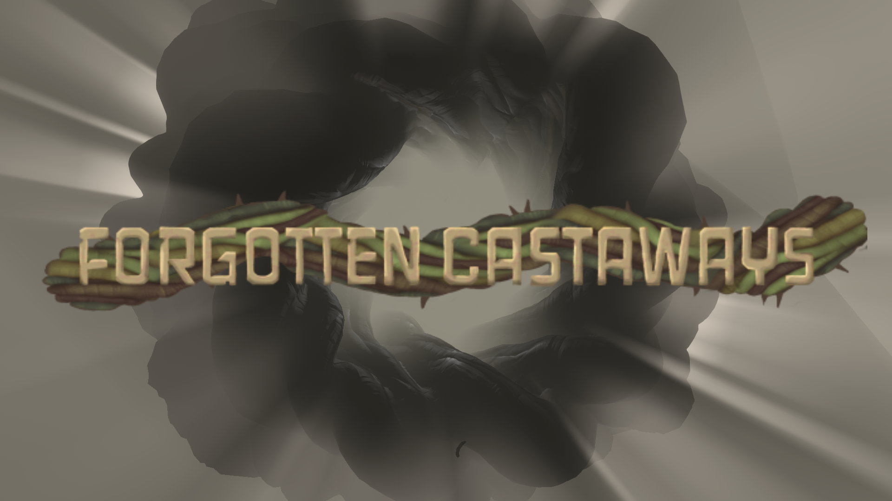

# Forgotten Castaways
# 

*This is a story mod that takes place almost entirely inside of Dark Bramble. Be aware that the description ahead features some spoilers for the base game of Outer Wilds. There are also some small, very early game spoilers for the mod itself. Expected playtime is roughly 6-8 hours.*

Follow the trail of four Nomai who, when their escape pods were rendered inoperable, were forced to retreat farther into the Bramble in search of shelter and resources. Read their logs, rediscover what they found, and uncover the secrets of the Deep Bramble.

This mod is made by someone who has already beaten the base game, and is therefore tailored to that experience. However, I have attempted to make it also playable alongside the base game. **If you have an existing save file, I would suggest using that, as the first hint as to where to go will only appear if certain base-game facts are known.**

**This mod does require the DLC for Outer Wilds, Echoes of the Eye.**

**Caution when using with the Light Bramble mod. It makes the dimensions pitch black and may reveal several hidden things, breaking progression.**
# Currently supported languages
- English
- Korean
- Japanese

# Note for translators
Due to some implementation details, the tools and methods found in the [New Horizons docs](https://nh.outerwildsmods.com/guides/translation/) will create a translation file that misses a few things. The extra things to account for can be found in the translation_notes.txt file on the [GitHub Repo](https://github.com/coderCleric/DeepBramble/blob/main/translation_notes.txt) for the mod. If you happen to notice any other translations that don't function properly and aren't noted in that doc, please make an issue on the repository!

## Credits

- coderCleric
  - Code
  - Story
  - Writing
  - Design
  - Modeling
- My Beautiful, Handsome, Amazing Spouse
  - 2D Assets
  - Feedback
  - Editing
  - Puzzles
  - Story
  - Final Song
  - Other custom music
- Repcon
  - Character Modeling
  - Rigging
  - Animating
  - Texturing
  - Playtesting
- Raime000
  - Audio Editing
  - Playtesting
- Evorox
  - Playtesting
  - Story
  - Feedback
  - Puzzles
  - Alient Writing Asset
- Ceryus
  - Playtesting
  - Story
  - Feedback
  - Puzzles

## Acknowledgements

- Thank you to the members of the Outer Wilds modding Discord server for your support, this mod would never have been possible without the help of you lovely people!
- Thank you to the following for their help with late development playtesting
  - JohnCorby
  - Etherpod
  - GameWyrm
  - Pikpik
  - Anon
- Thank you to the following for creating translations!
  - Barirn - Korean translation
  - nepyanagi - Japanese translation
- Title screen music derived from The Lost Reels by Andrew Prahlow
- Custom music made with GarageBand

## Disclaimer
This work is unofficial fan content created under permission from the Mobius Digital Fan Content Policy. It includes materials which are the property of Mobius Digital and it is neither approved nor endorsed by Mobius Digital.
